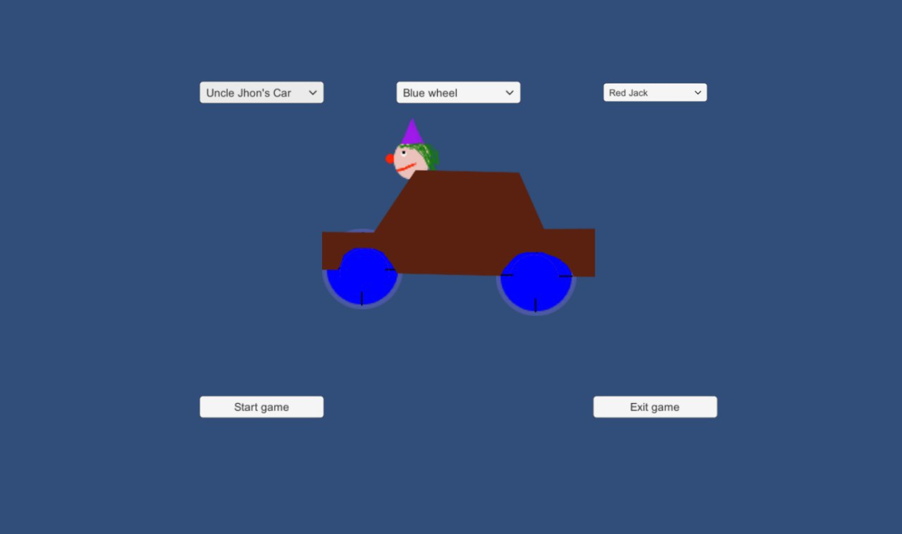
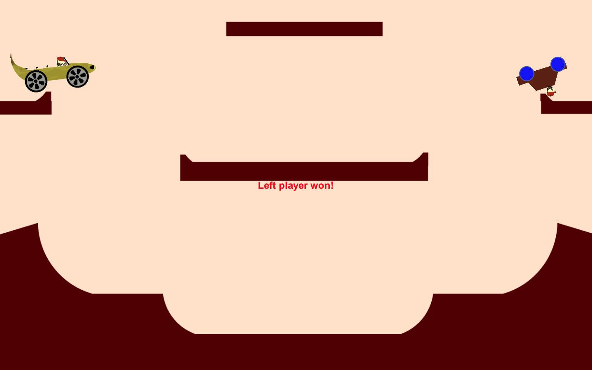
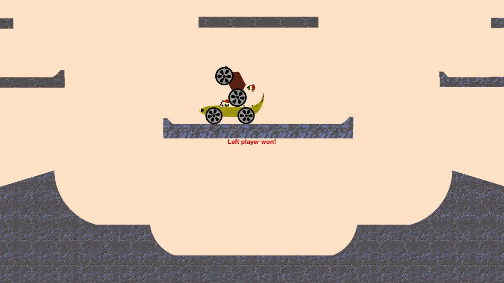
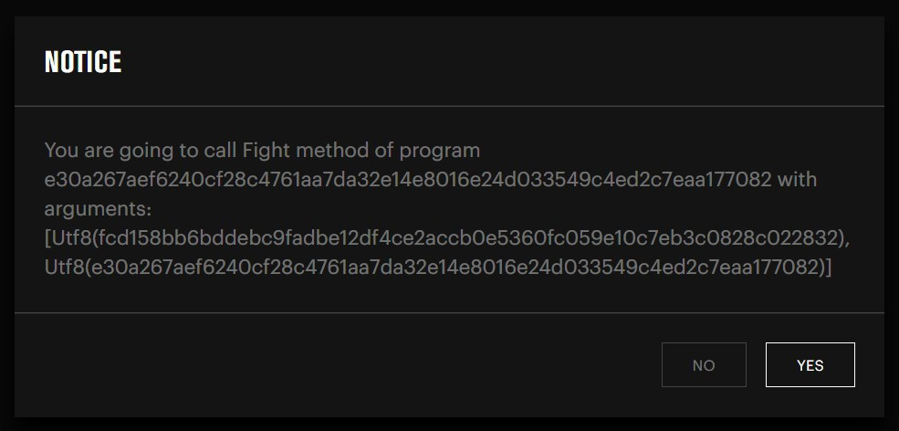

We have done a blockchain game named Head & Road.

This is a PvP Fighter with a possibility of collecting unique items. Users fight in an arena using cars. You have to destroy the head of your opponent car’s driver to win.

This is how our interface looks like.

At the beginning of your session you should collect your car from some items like head, car body and wheels.
<p align="center">
  
</p>

Then you can fight with your opponent on some arenas like this.

<p align="center">
  
</p>

Or like this.
<p align="center">
  
</p>

At the end of every session we generate the transaction in the Pravda blockchain with all the information about this fight: types of the cars, users’ addresses and the result of the fight.

```
curl -X POST -H "Content-Type: application/json" --data '{"address": "21B262DDCF883D69D4642CFA21E39B463F143BA0729D195E16C3E9BD1BC139EA", "method": "Fight", "args": [{"tpe": "bytes", "value": "e30a267aef6240cf28c4761aa7da32e14e8016e24d033549c4ed2c7eaa177082"}, {"tpe": "bytes", "value": "fcd158bb6bddebc9fadbe12df4ce2accb0e5360fc059e10c7eb3c0828c022832"}] }' localhost:8087/api/program/method
```

<p align="center">
  
</p>


You can try playing our game with the tutorial.

Download and start expload-desktop.
